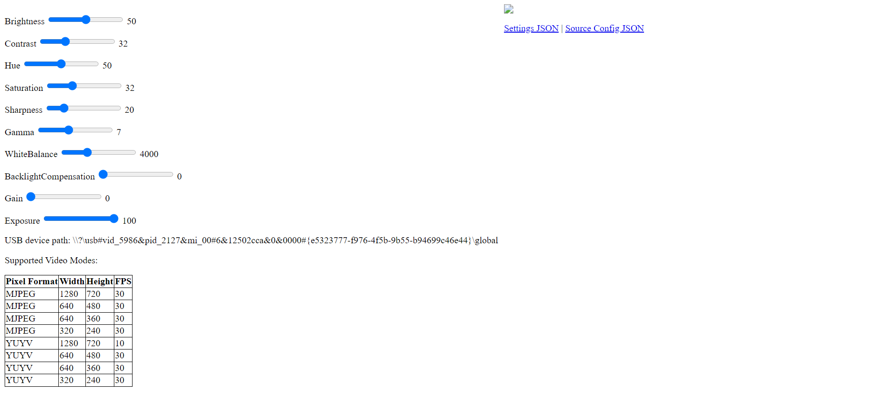

.. _advancedcv:

Advanced Vision Tutorial
========================

Tutorial Overview
-----------------

Welcome to the Advanced Vision tutorial!

The purpose of this tutorial is to demonstrate advanced computer vision using
classes provided by this package. Specifically, this tutorial will focus on the USBCamera,
BasicStreaming, and CustomStreaming classes. From these classes, you will learn how to use multiple
cameras reliably and how to stream camera feeds back to the Driver Station.

Class Overviews
---------------

The USBCamera class provides a simple and easy interface to capture footage from a compatible camera using OpenCV.

.. note::
    If you are unfamiliar with the USBCamera class, it is recommended that you read the :ref:`USBCamera API Page<usbcamera>`
    to gain a better understanding.

The BasicStreaming class simply allows for a camera feed to be sent back to the Driver Station.

.. note::
    If you are unfamiliar with the BasicStreaming class, it is recommended that you read the :ref:`BasicStreaming API Page<basicstreaming>`
    to gain a better understanding.

The CustomStreaming class allows you to modify the camera feed before sending it back to the Driver Station.

.. note::
    If you are unfamiliar with the CustomStreaming class, it is recommended that you read the :ref:`CustomStreaming API Page<customstreaming>`
    to gain a better understanding.

Contents
--------

Now that you are more familiar with the USBCamera class, it's time to learn about reliably using multiple cameras at once.

Multiple cameras
^^^^^^^^^^^^^^^^

Thanks to the OpenCV library, creating multiple cameras is a straightforward process.
When trying to create a camera, simply set the camNum parameter of the USBCamera class
to the number of the camera (0 for the first camera pluged in unless there is a built in webcam).

.. code-block:: python

    # Import the class
    from frc_apriltags import USBCamera

    # Instantiate the class
    cam0 = USBCamera(camNum = 0)
    cam1 = USBCamera(camNum = 1)

    # Main loop
    while (True):
        # Get and display the streams
        cam0.displayStream(streamType = 0)
        # cam1.displayStream(streamType = 0)

        # Press q to end the program
        if ( (cam0.getEnd() == True) or (cam1.getEnd() == True) ):
            break

.. warning::
    While it is possible to run this code without raising errors, OpenCV will raise a cv2.Error when you attempt to process
    the image from a non-existant camera.

Reliably using multiple cameras
^^^^^^^^^^^^^^^^^^^^^^^^^^^^^^^

The above code is the most basic way of acessing multiple camera feeds, but, with the numbers being arbitarily
defined on OS boot, it is possible that your OS switches camera zero and camera one. To solve this, we will
specify the camPath variable and provide the camera's path, as shown below:

.. tabs::
    .. tab:: Windows
        As of now, we have not figured out a way to get the camera path for Windows.
        Until we do, please continue to use numbers to identify your cameras.

        .. code-block:: Python

            # Import the class
            from frc_apriltags import USBCamera

            # Instantiate the class
            cam0 = USBCamera(camNum = 0)
            cam1 = USBCamera(camNum = 1)

            # Main loop
            while (True):
                # Get and display the streams
                cam0.displayStream(streamType = 0)
                # cam1.displayStream(streamType = 0)

                # Press q to end the program
                if ( (cam0.getEnd() == True) or (cam1.getEnd() == True) ):
                    break

    .. tab:: macOS
        As we do not have access to devices that run macOS, we are unable to provide proper documentation at this time.

    .. tab:: Linux
        To find the path of a camera on Linux, please run the following command:

        .. code-block:: sh

            find /dev/v4l
        
        This command finds all devices that support video capturing on Linux devices.
        Unfortunately, the output of this command varies by device so we cannot provide a good example here.
        For the Jetson Nano, you are looking for something like this:

        .. code-block:: sh

            /dev/v4l/by-path/platform-70090000.xusb-usb-0:2.4:1.0-video-index0

        With the /dev/v4l path aquired, simply pass the value as a String into USBCamera as the camPath parameter.

        .. note::
            The camNum parameter is still required, but the camPath variable will be used to create the camera. 

        .. code-block:: python

            # Import the class
            from frc_apriltags import USBCamera

            # Instantiate the class
            cam0 = USBCamera(camNum = 0, camPath = "/dev/v4l/by-path/platform-70090000.xusb-usb-0:2.4:1.0-video-index0")
            cam1 = USBCamera(camNum = 1, camPath = "/dev/v4l/by-path/platform-70090000.xusb-usb-0:2.2:1.0-video-index0")

            # Main loop
            while (True):
                # Get and display the streams
                cam0.displayStream(streamType = 0)
                # cam1.displayStream(streamType = 0)

                # Press q to end the program
                if ( (cam0.getEnd() == True) or (cam1.getEnd() == True) ):
                    break

Basic Streaming
^^^^^^^^^^^^^^^

The Basic Streaming class allows for the user to send data back to
SmartDashboard or ShuffleBoard using CSCore. As this class was designed
for simplicity, it lacks any form of customization on the coprocessor
and can only be used with its default settings. To start the stream,
run the following code:

.. code-block:: python

    from wpimath.geometry import *
    from frc_apriltags import BasicStreaming, NetworkCommunications

    # Starts the required network tables
    comms = NetworkCommunications(2199)

    # Defines the camera resolution (width x height)
    camRes = (240, 144)

    # Creates a camera for the drivers
    driverCam = BasicStreaming(camNum = 0, resolution = camRes)

    # Main loop
    while (True):
        pass

This code starts the required network tables by instantiating the NetworkCommunications class
(2199 is used as an example team) and then creates the basic stream camera. To keep this camera
running, however, the program must remain active, hence the while loop.

Now that the camera is running, it is possible to edit some of the settings using the CSCore dashboard.
To open this dashboard, click `this link <http://localhost:1181>`_ which will open into a dashboard
that looks similar to this:

On this page, you can tweak the settings of the camera to your hearts content. You can also tweak
a few settings in the ShuffleBoard camera widget as well.

Custom Streaming
^^^^^^^^^^^^^^^^

The Basic Streaming class allows for the user to send processed data back to
SmartDashboard or ShuffleBoard using CSCore. This class does not allow for any
customization once the once it has been instanciated, so any cugstomization
will require that the program is stopped and then restarted.
To start the custom stream, run the following code:

.. code-block:: python

    from wpimath.geometry import *
    from frc_apriltags import CustomStreaming, NetworkCommunications

    # Starts the required network tables
    comms = NetworkCommunications(2199)

    # Defines the camera resolution (width x height)
    camRes = (240, 144)

    # Creates a camera for the drivers
    driverCam = CustomStreaming(camNum = 0, resolution = camRes, fps = 15)

    # Prealocate space for the detection stream
    stream = driverCam.prealocateSpace()

    # Main loop
    while (True):
        # Gets the stream
        stream = driverCam.getUnprocessedStream()

        # OpenCV processing here...
        # 

        # Sends the stream back
        driverCam.streamImage(stream = stream)

        # Press q to end the program
        if ( driverCam.getEnd() == True ):
            break

This code does the same thing as the BasicStreaming implementaion,
but allows you to send a processed image back to the driver station by passing
that image as the stream parameter in streamImage().

With the camera running, we can use getUnprocessedStream() to get the stream from the
camera. With this stream stored as a variables, we can use OpenCV to process the stream
and then send that back with streamImage(). Examples of OpenCV applications include
object tracking, ROI fields, and other automated functions. To see the stream being sent you
can once again open the CSCore dashboard with `this link <http://localhost:1181>`_,
but it will no longer have any of the customization options.

End
---

Congratulations! You now have an understanding of all the computer vision functions that this package has
to offer!

The next tutorial will be on (insert topic here).