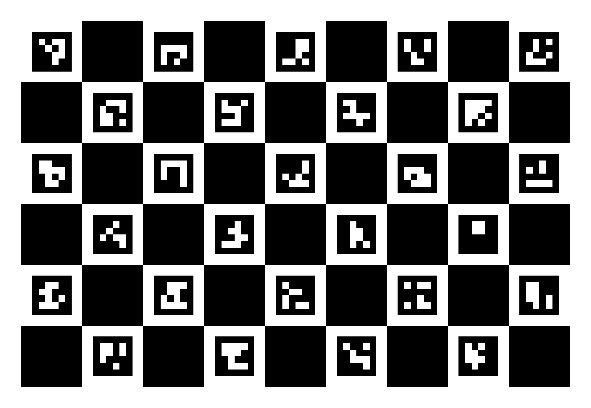
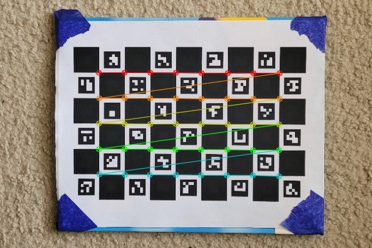

.. _calibratedcv:

Calibrated Vision Tutorial
==========================

Tutorial Overview
-----------------

Welcome to the Calibrated Vision tutorial!

The purpose of this tutorial is to demonstrate calibrated computer vision using
classes provided by this package. Specifically, this tutorial will focus on the USBCamera and Calibrate classes
and how to use them in tandem.

Class Overviews
---------------

The USBCamera class provides a simple and easy interface to capture footage from a compatible camera using OpenCV.

.. note::
    If you are unfamiliar with the USBCamera class, it is recommended that you read the :ref:`USBCamera API Page<usbcamera>`
    to gain a better understanding.

The Calibrate class provides a user-friendly way to calibrate compatible cameras using OpenCV.
This tutorial will not go into too much depth regarding this class, as all methods needed from it
are automatically called by USBCamera. However, if you are interested in using it for 
other applications, please reference the :ref:`Calibrate API Page<calibrate>` for more details.

Contents
--------

With your new understanding of the USBCamera class, we will now build upon it to include
camera calibration, an essential part of this package.

Why calibrate a camera?
^^^^^^^^^^^^^^^^^^^^^^^

Some of you may be asking why calibrating your camera is necessary for AprilTags detection.
The answer to this question is that calibrating your camera allows this package to accurately associate
2D pixels with 3D coordinates.

If this step was not performed, the camera (particularly a high FOV camera) would experience distortion at the
edges of its FOV, making any detections in that area unreliable and inaccurate.

Prior to calibration
^^^^^^^^^^^^^^^^^^^^

Before you begine calibrating your camera, you will need the calibration target used by
this package. The aforementioned target is a 9 square by 6 square target with each square being
27.5mm wide. While you could generate this target yourself using `this guide <https://docs.opencv.org/4.x/da/d0d/tutorial_camera_calibration_pattern.html>`_
on OpenCV's website, we recommended using the target provided below which is from `calibDB <https://calibdb.net>`_.

.. note::
    When printing this target, please print it on 8.5" by 11" paper with a landscape orientation, no margins, and 100% scale.

After you have printed this target, please ensure that it cannot bend or flex by securing it to a piece of lexan, pegboard, or
something similar. After securing the target, ensure than you can move it around freely as this is important for the calibration.

Preparing to calibrate
^^^^^^^^^^^^^^^^^^^^^^

With yoru target prepared for use, we will now build off of the :ref:`Basic Vision <basiccv>` tutorial
to include camera calibration. This is accomplished with the following code:

.. code-block:: python

    # Import the class
    from pathlib import Path
    from frc_apriltags import USBCamera

    # Get the directory path
    dirPath = Path(__file__).absolute().parent.__str__()

    # Instantiate the class and calibrates the camera
    camera = USBCamera(camNum = 0, resolution = (1280, 720), calibrate = True, dirPath = dirPath)

    # Main loop
    while (True):
        # Get and display the stream
        camera.displayStream(streamType = 0)

        # Press q to end the program
        if ( camera.getEnd() == True ):
            break

The code above starts by importing the Path and USBCamera classes from pathlib and frc_apriltags, respectively.

Next, the code will get the current absolute path of the file and store that path, as a String, in dirPath. This step
is done to ensure the calibration images are created in the correct directory and can be found 
no matter where the python (or python3) command is being run from.

After the path has been aquired, it is time to create an instance of USBCamera. This time, however, we will
be setting the calibrate parameter to True and setting the dirPath variable to dirPath. This ensures that
the calibration routine start properly and saves/reads the calibration images from the correct directory.

Following this is the standard method of displaying the stream and ending the program that you've seen before
in the Basic Vision tutorial.

.. warning::
    Do not run this code yet as there is a little more to explain about setting the calibrate parameter to True.

Calibrating your camera
^^^^^^^^^^^^^^^^^^^^^^^

Now that the calibrate variable has been set to True, the USBCamera class has been instructed to run
its calibration routine, slightly changing what happens when the program runs.

Now instead of seeing a live stream, you will see a very laggy stream called Calibration.
This stream is purposefully laggy as it is running *cv2.findChessboardCorners()*, a method that
does not function correctly unless the calibration target you prepared before is visible in the camera's FOV.
Once the target is in the FOV, the stream will become live and the target will have annotations on it.
Those annotations will make the board look like the image below:

When the annotations are visible on the board and the stream is not lagging, press the p key to take a calibration image.
In total, you will be taking 15 calibration images and the package will require you to press p for all of them. When you are
finished, the package will display all the iamges you have taken and show you if it could find the target in them. If
the package cannot find the target in more than half of the images, it will automatically restart the calibration
routine.

.. note::
    It is recommended that the first five images you take should be taken with the board parallel to your camera
    and in the four corners and center of the camera's FOV. After this, it is encourged that you take images
    with more extreme angles to properly calibrate the camera.

End
^^^

Congratulations! You have learned now to sucesfully calibrate your camera!

The next tutorial will explain how to use this class with multiple cameras and how to stream
camera feeds to the driver station.

.. warning::
    It is rather difficult to calibrate cameras with an FOV greater than 90 degrees. For this reason,
    we recommended using a camera with an FOV of less than or equal to 90 degrees.